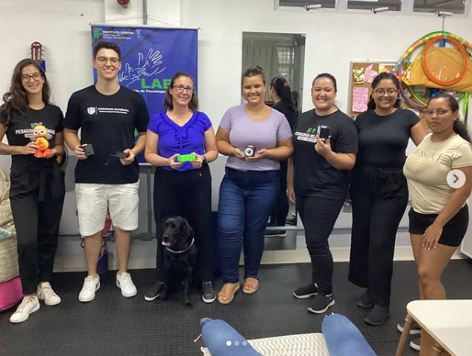
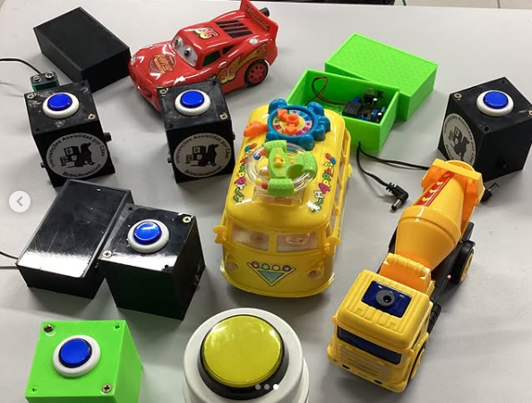

# Projeto-Brinquedo-Mágico

O projeto **Brinquedo Mágico** é uma iniciativa da professora **Ivani Cristina Voos**, coordenadora do projeto de pesquisa **BrincAcessível e Serviços Assistidos por Animais**, situado no Instituto Federal de Educação, Ciência e Tecnologia de Santa Catarina – Campus Palhoça Bilíngue. O desenvolvimento do acionador de brinquedos foi feito pelo aluno **Lucas Martins Wollinger**, estudante de engenharia eletrônica DAELN no Instituto Federal de Educação, Ciência e Tecnologia de Santa Catarina – Campus Florianópolis.

**O principal objetivo é projetar e desenvolver um acionador de brinquedos para auxiliar crianças com deficiência, permitindo que elas tenham autonomia relacional no ato de brincar, sem a necessidade de ajuda constante de um adulto.**

 