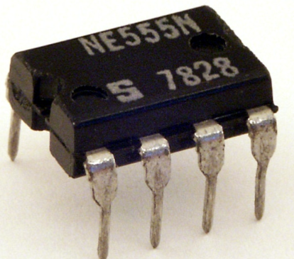
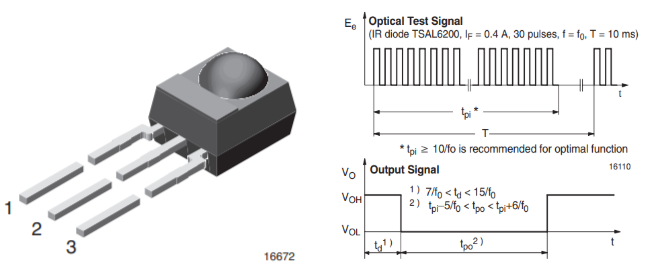
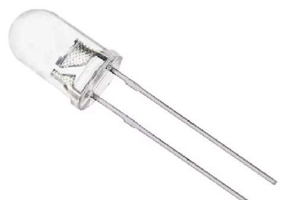
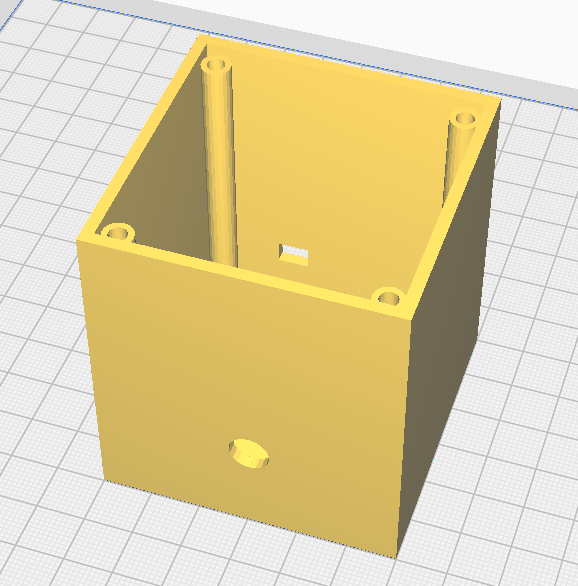
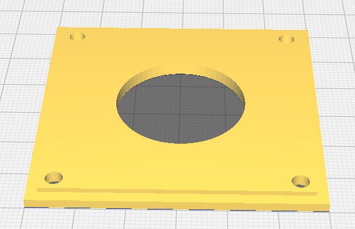
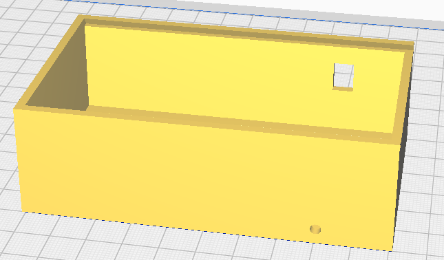
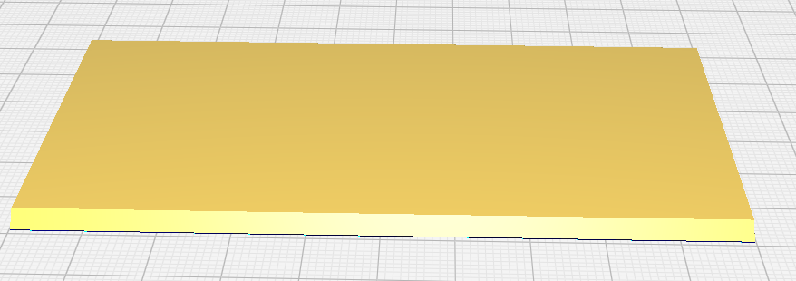

# Design:

Durante o desenvolvimento do projeto, optou-se por utilizar um circuito totalmente analógico devido à falta de conhecimento sobre microcontroladores na época, ao domínio da eletrônica analógica por parte do desenvolvedor e à disponibilidade de tempo para a conclusão do projeto. Dessa forma, a escolha se mostrou a mais adequada.

Uma próxima evolução do projeto, será faze-lo com um microcontrolar.

## Principais componentes usados:

* NE 555
    * 
* TSOP4838
    * 
* TSAL6200
    * 

## Projeto do Case 

Para o transmissor e receptor foi desenvolvido um case especifico.

* Case do Transmissor
    * 
    * 
* Case do Receptor
    * 
    * 
