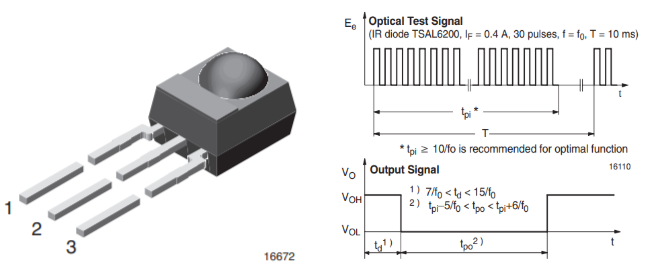
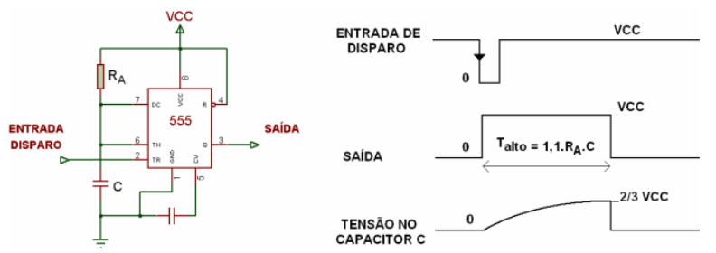
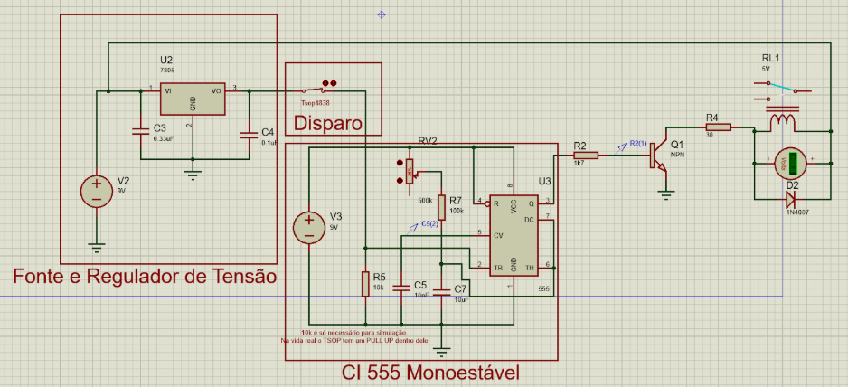
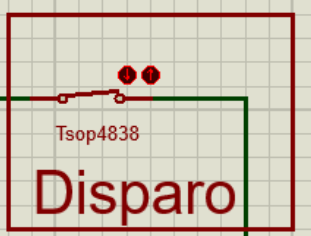
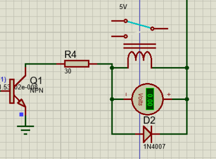
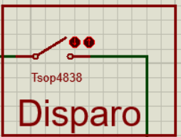
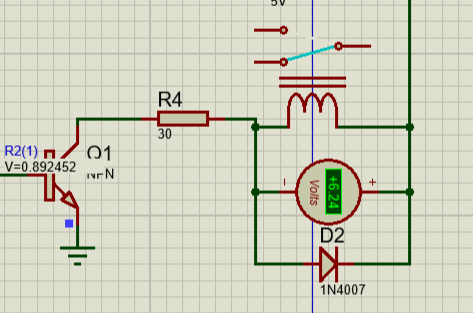
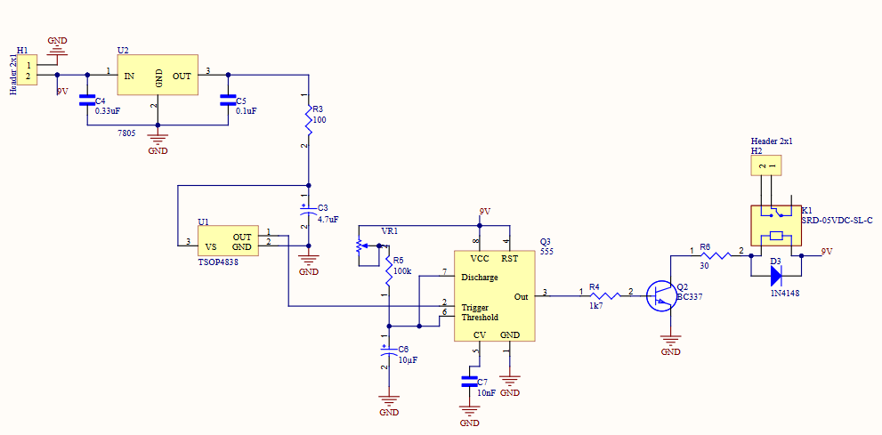
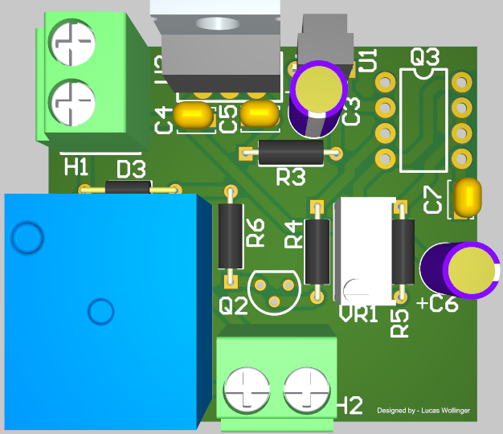

# Receptor

## Sensor TSOP4838 38kHz 

A ideia era fazer um acionamento com delay, porém visto na imagem anterior, o circuito receptor quando é detectado 38kHz, ele vai para nível lógico baixo. Isto não seria um problema, porém este estágio de nível lógico baixo ele é muito pequeno (Obs: Mesmo que o transmissor continue acionado, o TSOP4838 volta para nível lógico alto), portanto não seria possível, descarregar um capacitor para ter-se um delay no relé. 

Após muita pesquisa, foi chegado a conclusão que o melhor a ser usado seria um NE555 com modo monoestável, onde ainda seria possível determinar o tempo de acionamento do brinquedo.

## Multivibrador Monoestável

A operação monoestável é a responsável pela caracterização do 555 como uma “máquina de temporização”. É justamente essa operação que ativa a saída do 555 por um determinado tempo. Quando o sinal na entrada de disparo apresentar uma borda negativa, o comparador relativo a essa entrada aciona o Flip-Flop do 555 e a saída deste vai a nível alto, permanecendo aí por um período de tempo dado por:

Talto = 1.1 * RA * C

O circuito do temporizador 555 foi configurado no modo monoestável. Quando ocorre uma borda de descida no pino de disparo, o comparador de 1/3 Vcc ativa o Flip-Flop, resultando em uma saída em nível lógico alto.
Nesse estado, o capacitor C começa a se carregar por meio do resistor RA utilizando a tensão de alimentação Vcc. Durante o período de carga, a saída do circuito permanece alta. Assim que a tensão no capacitor atinge 2/3 de Vcc, o segundo comparador é acionado, fazendo com que o Flip-Flop altere seu estado e leve a saída ao nível lógico baixo.
Nesse momento, o transistor de descarga conduz, permitindo que o capacitor C se descarregue rapidamente. Esse ciclo pode ser reiniciado com a aplicação de um novo pulso de disparo.

OBS: Se a entrada de disparo permanecer em nível baixo por um tempo superior ao intervalo Talto, a saída permanecerá em nível alto até que o sinal de disparo volte ao nível lógico alto.

## Simulação

o circuito foi simulado no software proteus que não havia o TSOP4838 como componentes, portanto foi usado uma chave para simular o mesmo.

O resistor R5 é apenas uma modelagem para simulação. Na vida real o TSOP tem um resistor de pull-up e por conta deste não se pode adicionar R5.

Quando o circuito é acionado, ou seja, o nível lógico da entrada trigger é baixa, o circuito temporizador inicia a contagem, e portanto seguindo aquela equação vista anteriormente pode-se determinar o tempo que deseja ajustando o potenciômetro.

### Visualização

* Estado comum da chave e do relé.
    * 
    * 

* Estado acionado da chave e do relé.
    * 
    * 

## Montagem 
Toda montagem foi feita no software altium designer.
 

* Visualização do Layout:
    * 
* Visualização 3D:
    * 