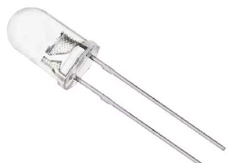
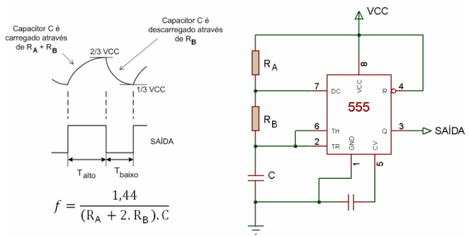
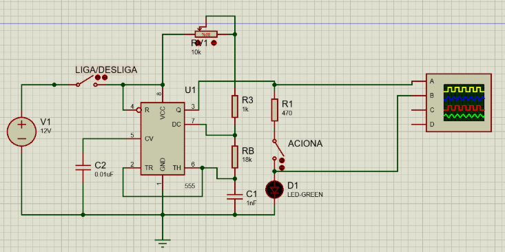
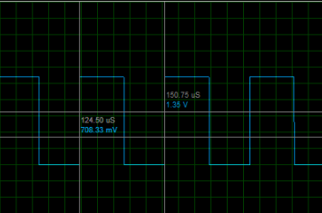
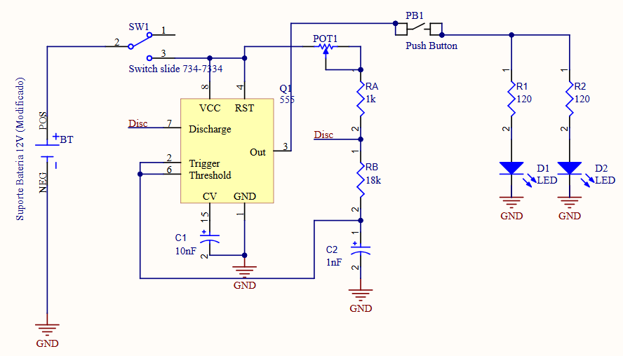
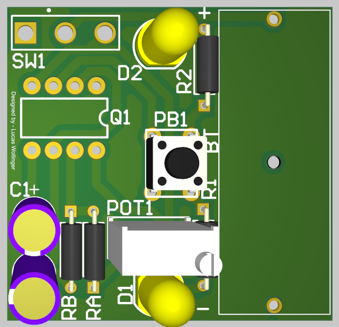

# Transmissor 

## Led Transmissor IR de Alta Potencia

Foi definido usar este LED em especifico, pois possui uma corrente direta alta e com isso garante ter maior facilidade de acionamento do receptor mesmo se o led não estiver diretamente direcionado para o receptor.

## Multivibrador Astável

No modo de operação astável do CI 555, o circuito funciona como um oscilador, gerando uma saída digital com frequência e ciclo de trabalho ajustáveis. O processo ocorre por meio do carregamento e descarregamento contínuo de um capacitor. Inicialmente, o capacitor carrega-se através dos resistores RA e RB até que sua tensão ultrapasse 2/3 Vcc, acionando o comparador interno e disparando o reset do flip-flop, o que faz a saída do pino 3 ir para nível baixo. Nesse momento, um transistor interno é ativado, descarregando o capacitor pelo resistor RB até que sua tensão caia abaixo de 1/3 Vcc. Com isso, o flip-flop é acionado novamente, a saída retorna ao nível alto e o capacitor começa a recarregar. Esse ciclo se repete continuamente, mantendo a tensão do capacitor entre 1/3 Vcc e 2/3 Vcc, resultando em um sinal de onda quadrada na saída.

Neste caso em específico, era necessário 50% de duty cycle e frequência de 38 kHz.

## Simulação

O transmissor foi simulado no software proteus e é um circuito com o CI 555 ligado em modo astável, portanto gerando pulsos quadrados.
Estes pulsos quadrados são de 50% de duty cycle e com 38KHz especificamente.

### Visualização

* Forma de Onda 38kHz e 50% duty.
    * 

f = 1/T = 1 / (150,75us - 124,5us) = 38KHz

## Montagem 
Toda montagem foi feita no software altium designer.
 

* Visualização do Layout:
    * 
* Visualização 3D:
    * 