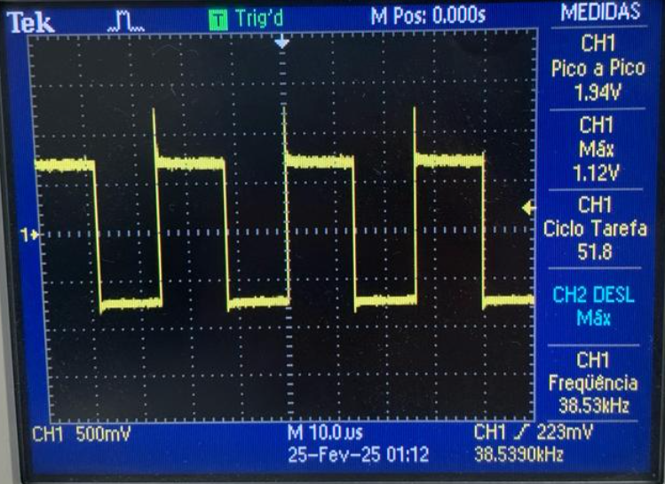
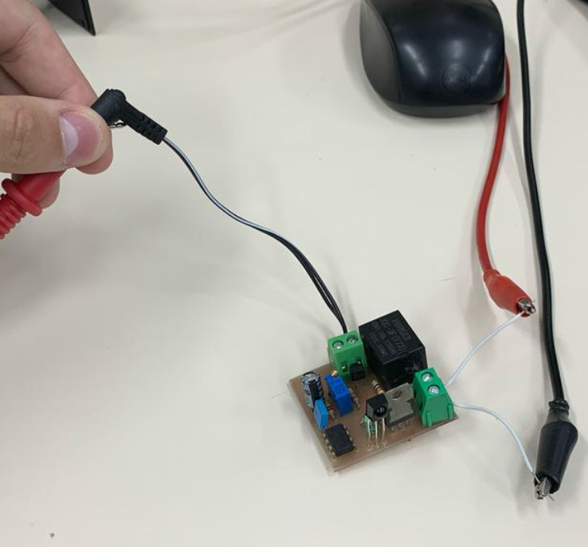
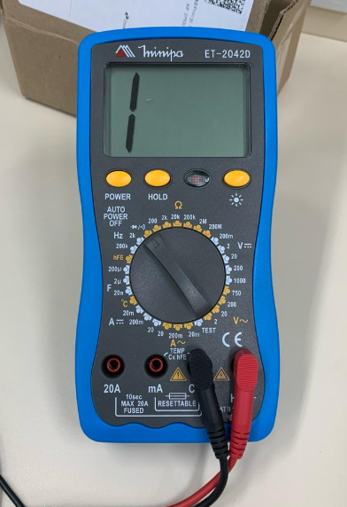
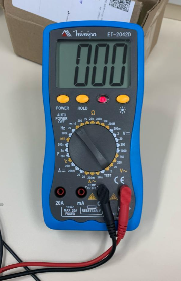
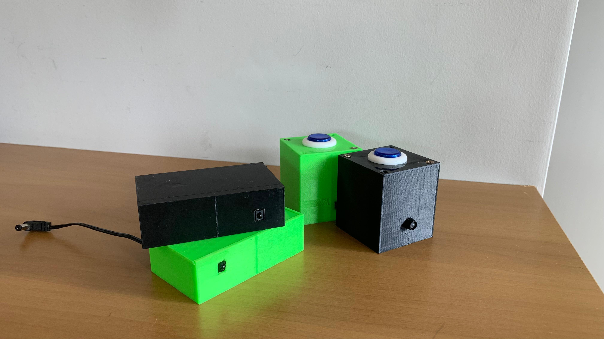
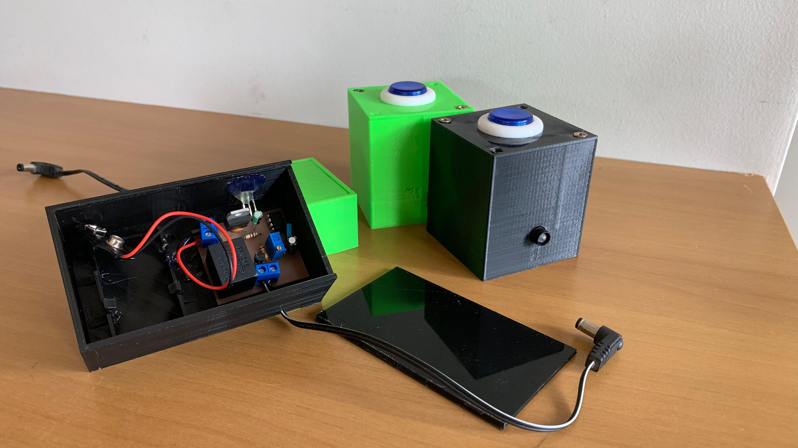

# Implement

Aqui será mostrada o circuito Brinquedo Mágico em funcionamento e seu resultado final.

## Funcionamento

* Formas de Onda Transmissor
    * 

Pode-se observar que os 50% de duty e os 38kHz foram conquistados com sucesso.

* Circuito Receptor:
    * 
    * Estado de Modo Comum: (Sem continuidade = Não acionado):
        * 
    * Estado de Modo Acionado: (Com continuidade = Acionado):
    * 

## Montagem final

## Referências

Foi necessário um estudo sobre multivibradores e sobre o CI555 para a resolução deste projeto.

**Materiais de apoio:** O TEMPORIZADOR 555 - Charles Borges de Lima / Material Multivibradores - Prof. Clóvis Antônio Petry.