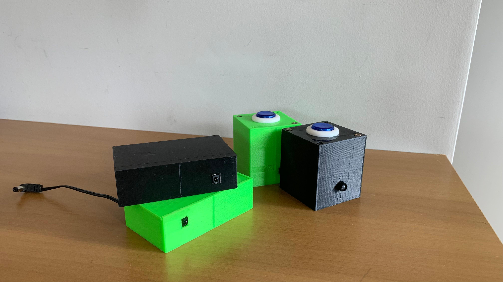
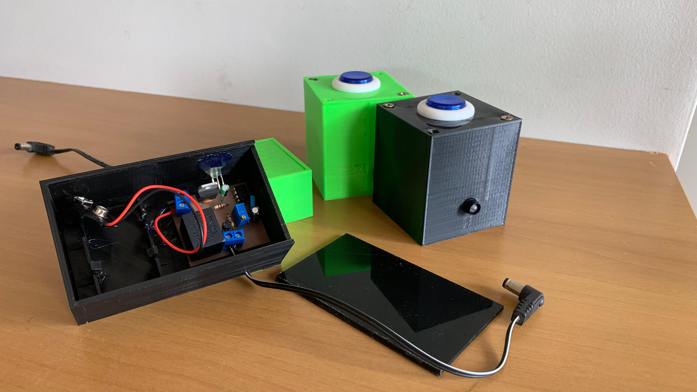

# Operate 

Aqui será mostrado os resultados finais de montagem.

## Montagem final

## Referências

Foi necessário um estudo sobre multivibradores e sobre o CI555 para a resolução deste projeto.

**Materiais de apoio:** O TEMPORIZADOR 555 - Charles Borges de Lima / Material Multivibradores - Prof. Clóvis Antônio Petry.